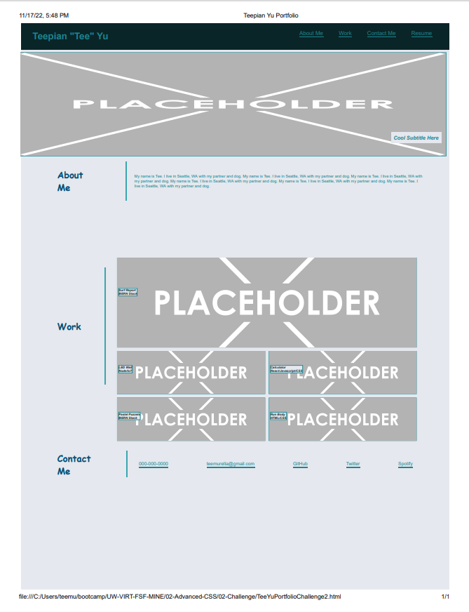

# TeeYuPortfolioChallenge2AdvancedCSS

## Description

For this module, the focus was creating a portfolio.  The employer is looking to see samples of work on a working portfolio website.  From scratch, we created an HTML and css style sheet to resemble the mock up provided.  

## Installation

First, we created a blank HTML and css style sheet for our website.  Upon laying out the headers, body, and footer to correspond with the mock up, different css style elements were added to give the portfolio color, images and a layout that is pleasing to the eye.  

## Usage

This module helped me understand how to create HTML and CSS from scratch.  As we continue through this course we will continue to build and add to our portfolio.  By creating a clean, optimized portfolio website job recruiters will be able to evaluate my work and see if I have the abilities to handle the job.  

https://teemurella.github.io/TeeYuPortfolioChallenge2AdvancedCSS/